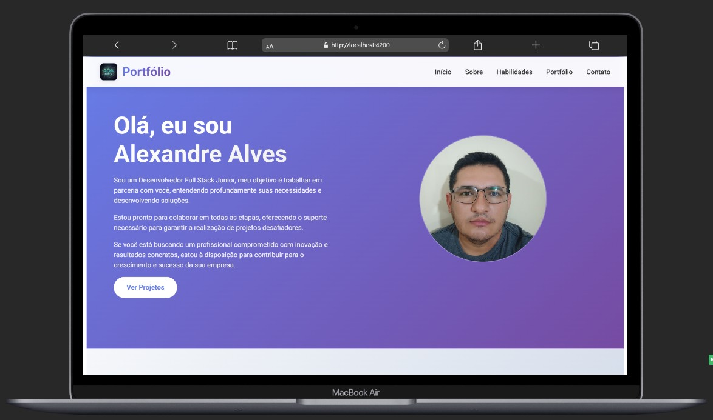
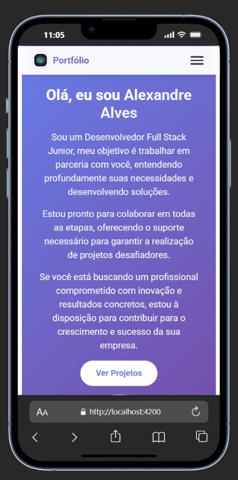

# 🚀 Portfólio Pessoal - Alexandre Alves

> **Sou um Desenvolvedor Full Stack Junior** que está sempre em busca de desafios, e eterno aprimoramento, afinal nossa área de trabalho evolui a cada dia.

## 📋 Índice

- [✨ Sobre o Projeto](#-sobre-o-projeto)
- [🎯 Funcionalidades](#-funcionalidades)
- [🛠️ Tecnologias Utilizadas](#️-tecnologias-utilizadas)
- [🚀 Como Executar](#-como-executar)
- [📱 Responsividade](#-responsividade)
- [🎨 Estrutura do Projeto](#-estrutura-do-projeto)
- [📸 Screenshots](#-screenshots)
- [🔗 Links](#-links)
- [📞 Contato](#-contato)

## ✨ Sobre o Projeto

Este é um portfólio pessoal desenvolvido com **Angular**, apresentando meus projetos, habilidades e experiência profissional de forma elegante e responsiva.

### 🌟 Destaques

- **Design Moderno**: Interface limpa e profissional
- **Totalmente Responsivo**: Funciona perfeitamente em todos os dispositivos
- **Performance Otimizada**: Carregamento rápido e suave
- **Navegação Intuitiva**: Menu de navegação fluido e funcional

## 🎯 Funcionalidades

### 📱 **Seções Principais**

- **🏠 Início**: Apresentação pessoal e chamada para ação
- **👤 Sobre**: Experiência, formação e objetivos profissionais
- **💪 Habilidades**: Soft skills e tecnologias com níveis de proficiência
- **📁 Portfólio**: Projetos desenvolvidos com demos em vídeo
- **📞 Contato**: Informações de contato e redes sociais

### 🎭 **Recursos Interativos**

- **Navegação Suave**: Scroll automático entre seções
- **Menu Mobile**: Navegação otimizada para dispositivos móveis
- **Modais de Vídeo**: Visualização de demos dos projetos
- **Animações CSS**: Efeitos visuais elegantes e suaves
- **Bordas Animadas**: Elementos visuais em movimento

## 🛠️ Tecnologias Utilizadas

### **Frontend**

- 
- 
- 
- 

### **Ferramentas**

- 
- 
- 

## 🚀 Como Executar

### **Pré-requisitos**

- Node.js (versão 16 ou superior)
- npm ou yarn
- Angular CLI

### **Passos para Execução**

1. **Clone o repositório**

```bash
git clone https://github.com/seu-usuario/portfolio.git
cd portfolio
```

2. **Instale as dependências**

```bash
npm install
```

3. **Execute o projeto**

```bash
ng serve
```

4. **Acesse no navegador**

```
http://localhost:4200
```

### **Build para Produção**

```bash
ng build --configuration production
```

## 📱 Responsividade

### **Breakpoints**

- **Desktop**: > 768px - Layout completo
- **Tablet**: ≤ 768px - Layout adaptado
- **Mobile**: ≤ 669px - Layout compacto
- **Mobile Pequeno**: ≤ 455px - Layout muito compacto

### **Características**

- ✅ Header responsivo com menu mobile
- ✅ Grid layouts adaptativos
- ✅ Imagens e textos otimizados
- ✅ Navegação touch-friendly
- ✅ Performance em todos os dispositivos

## 🎨 Estrutura do Projeto

```
src/
├── app/
│   ├── components/
│   │   ├── header/          # Navegação principal
│   │   ├── about/           # Seção sobre
│   │   ├── skills/          # Habilidades e tecnologias
│   │   ├── portfolio/       # Projetos desenvolvidos
│   │   └── footer/          # Rodapé e contatos
│   ├── app.html             # Template principal
│   ├── app.css              # Estilos globais
│   └── app.ts               # Componente raiz
├── assets/
│   └── img/                 # Imagens e recursos
└── public/
    └── img/                 # Imagens públicas
```

## 📸 Screenshots

### **Desktop View**



### **Mobile View**



## 🔗 Links

- **🌐 Portfólio Online**: [Link do Deploy]
- **📚 GitHub**: https://github.com/alexandre020285
- **💼 LinkedIn**: https://www.linkedin.com/in/alexandre-oliveira-alves/
- **📧 Email**: alexandre0202dev@gmail.com

## 📞 Contato

### **Informações de Contato**

- **📧 Email**: alexandre0202dev@gmail.com
- **📱 Telefone**: +55 (21) 99052-0213
- **📍 Localização**: Rio de Janeiro, RJ - Brasil
